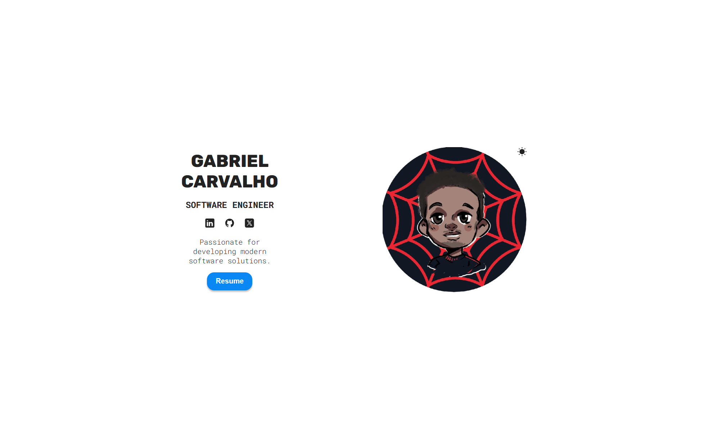

# 🚀 Gabriel Carvalho — Personal Portfolio

Welcome to my **Personal Portfolio**!  
Here you can explore my projects, skills, and a little about my journey as a Computer Engineering student.

---

## 💡 About This Project

This portfolio was designed to reflect my personal style and professional ambitions.  
The main goal is to offer visitors a clean and smooth experience while navigating through my work.

An interesting detail: the cartoon avatar featured on this page was created by my dear teacher and talented artist **Letícia**, as a parting gift when I completed the "Digital Game Programming" course.  
The background, inspired by *Miles Morales*, is a personal reference, since friends often said I reminded them of the character — and as a fan, I even have Spider-Man cosplays (Peter Parker and Miles) in my collection.

---

## 🛠️ Technologies Used

- ⚡ [React](https://reactjs.org/)
- ⚡ [Vite](https://vitejs.dev/)
- ⚡ [Node.js](https://nodejs.org/)
- 💡 JavaScript
- 💻 HTML & CSS
- 🎨 Canva (for custom icons and visuals)

---

## 📸 Preview

---

## 💬 Contact

If you'd like to connect, collaborate, or just chat — feel free to reach out!

📧 Email: cttbiel@gmail.com

---

🎨 Special thanks to **Letícia** for the amazing cartoon art featured in this portfolio.  
(*You can check out her work on [LinkedIn](https://www.linkedin.com/in/let%C3%ADcia-pedrosa-342397152/).*)  
<!-- Substitua pelo link real do perfil dela! -->

✨ Thank you for visiting my portfolio!  
If you like the project, don't forget to leave a ⭐, fork it, or send feedback.